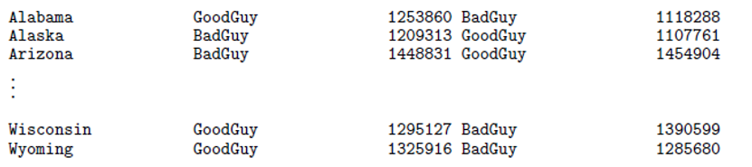

# [Federal Reserve](https://www.philadelphiafed.org/-/media/frbp/assets/institutional/education/lesson-plans/functions-and-characteristics-of-money-lesson.pdf) definition of currency

- Divisible: Easily divided into small parts to enable purchases.
- Portable: Easy to carry.
- Scarce: Relatively scarce and hard to obtain.
- Durable: Able to withstand the wear and tear of many using it.
- Stable: Value must remain relatively constant over time.
- Acceptable: Widely accepted as a medium of exchange. (May 22 is [Bitcoin Pizza Day](https://www.investopedia.com/news/bitcoin-pizza-day-celebrating-20-million-pizza-order/))

---

# Bank's ledger for our currency

| Public Key | Private Key | Amount |
|---|---|---|
| Rt~1~, Acct~1~ | Pwd~1~ | 1400 |
| Rt~2~, Acct~2~ | Pwd~2~ | 8600 |
| Rt~3~, Acct~3~ | Pwd~3~ | 17800 |
| Rt~3~, Acct~3~ | Pwd~3~ | -9000 |
| Rt~2~, Acct~2~ | Pwd~2~ | -4000 |
| ... | ... | ... |

---

# Routing number and account number public?

- They're printed on the bottom of every check you write. Your bank doesn't check permission before a debit posts. The protection comes afterward
- Under federal law, recurring debits from an account must be properly authorized by an authenticated statement
- The originating bank vouches for every debit. It guarantees that each debit has been properly authorized and is responsible for every debit sent in its name. A rogue debit isn't anonymous. You can get the money back by disputing the charge within 60 days.

#### *In what sense is the password private?*

---

# Crypto replaces trust in banks with trust in math

- It's called *public key cryptography*.  
- Based on (most) mathematicians' thinking that's there's no efficient way to find the prime factors of large number using traditional computers
- We'll consider a toy example in which the numbers are *very* small.  

---

# Toy example: five "simple" steps:

- Pick two primes *p, q* like 5, 11.  Multiply to get *n* 55
- **Using p and q** you can get two other numbers *e* 3 and *d* 27. No one else can because ... 
- The pair *n, e* 55, 11 is your *public key*, hold *d* 27 as your *private key*
- To deposit an amount *m* in your account, the payer sends you the encrypted number *m^e^ MOD n*
- You decrypt the amount by taking the encrypted number, raising it power *e* and MODing again by *n*

---

# The numbers in this public key ledger are larger, but still artificially small

| n, e - the public key |  d - the private key |  p, q (prime factors of n) |
|-----------------------|----------------------|----------------------------|
| 19951, 19  | 59  | 71, 281|
| 47851,  37 |  2557 | 109, 439 |
| 20971,  37 |  3061  | 67, 313 |
| 94739,  23 |  4967 | 211, 449 |
| 57023,  37 |   109 | 127, 449 |
| 80371,  29 | 13749 | 179, 449 |
| 29933,  13 |  2797  | 37, 809 |
| 17141,  11 |   611  | 61, 281 |
| 87487,   7 | 30863  | 89, 983 |
| 37391,  19 | 14599 | 139, 269 |

---

# You each have a unique page resembling the prior slide

## Except the numbers are different and I've covered the columns that are "secret" for others

## We're going to try playing the "Secrets and Trust Game"

---

# Brief video interlude on the history of Bitcoin

[PBS NOVA's The History of Crypto Goes Further Back Than You Think](https://youtu.be/vjGhiac85h4?si=4MKWxqVL8cRoO52V)

Questions?

---

# The video ends with a lead-in to the rest of today's story -- the *Blockchain*

The are two types of cryptography that underlie cryptocurrencies.   

- One is public key cryptography.  We now know that its security relies on the prime factorization puzzle - a problem that most mathematicians *think* is not computable on "traditional" computers. 
- The other is hashing, a puzzle that any *reasonable mathematician firmly believes* is equivalent to winning a lottery bigger than anything we can imagine and hence will never be computable on any hardware.

---

# A blockchain is a universally distributed ledger.  Think magic sheets of paper.   As soon as one person writes on theirs, everybody sees it. Consider what that might look like for an election ledger

# There are two flaws with this strategy for an election -- double voting and limitations on magic paper.

| Public Key | Associated Vote  |
|------------|------------------|
| 3182       | Candidate A      |
| 9554       | Candidate A      |
| 1197       | Candidate B      |
| 9762       | Candidate A      |
| 7201       | Candidate B      |
| 8650       | Candidate A      |
| 6569       | Candidate B      |
| 1125       | Candidate B      |
| 7714       | Candidate B      |
| 3998       | Candidate A      |

---

The Bitcoin ledger of transactions are grouped into blocks.  A transaction can only accessed by the holder of its private key and is *immutable*, which means they can't be changed.   The blocks are chained together by *nonces*, which are cryptographic hash puzzles. What must happen when Bob needs to pay Alice 3500 Satoshis for a pizza?

| Public Key | Bitcoin in Satoshis |  Transaction ID | Parent transaction ID | Miner Fee |
| ---------- | --------------------|  -------------- | --------------------- | --------- |
| PK~Bob~      | 2000              |  6036           | 0929                  | 2         |
| PK~Alice~    | 1000              |  CA2C           | A5E3                  | 1         |
| PK~Bob~      | 3000              |  4D23           | C137                  | 3         |
| ...          | ....              |  ....           | ....                  | ...       |

---

# Fun with cryptographic hash functions

- You can try a variety of them at [FileFormatInfo](https://www.fileformat.info/tool/hash.htm)
- Bitcoin uses SHA-256 to ensure the security of the distributed copies of its blockchain, that is, in its consensus algorithm.   More on this soon
- An amazing statistical fact beautifully illustrates exponential growth:  A killer rogue asteroid happens about once every 30 million years on average. This leads to the probability of a few billion people being killed by such an asteroid in the next second being 10~15~.  Compared to SHA-256, this killer asteroid event is 45 orders of magnitude more probable than a SHA-256 collision. 

---

Blockchain security relies on cryptographic hash functions

Suppose you have the results of the next election in the following file that you are sending for a final tabulation check.  Here BadGuy wins with 64,924,645 votes out cast, 50.7%, 26 states won

You want assurance that the file won’t tampered with en route to the destination.  So you use a hash function to compute a single number from it.   Good hash functions randomly scatter the numbers they compute. So, given two files that are very similar, the difference between their computed number is completely unpredictable.

What would a hacker who intercepted this and wanted to change the results so the GoodGuy wins, have to do?. 

---

# Bitcoin miners compete in a hash lottery to be first to validate a block of transactions

Insert your highlighted table here

---

- To validate the block they must check for any *double spending* going on in the block’s transactions
- But to win the Bitcoin that will go into the block, they have to be the first validator to solve for the *nonce*, which is a cryptographic hash solution to the following inequality: 
*BlockHash(including the nonce) < SHA-256 target*
- How hard is it to win the "solve for the nonce" lottery?   This is a question that the Bitcoin software can control quite precisely based on the speed of current computers and the goal of having the last of 21 million bitcoins mined in the year 2140.  Thereafter, miners will simply earn their continuing miner’s fees

---

# How double spending can occur in the chain of Bitcoin blocks that is accepted in the network

A block that holds two conflicting payments is thrown out as invalid. So the real danger isn't one bad block. It's two different versions of the distributed blockchains competing with each other. For example:

- Alice has exactly 100,000 satoshis.
- She pays Bob, a car dealer, 10,000 satoshis (call it transaction T~1~). T1 goes into Block 100, and Bob hands over the car.
- In secret, Alice signs a second transaction, T~2~, that sends the same 10,000 satoshis to another public key she owns.

T~1~ and T~2~ can't both be valid, because they spend the same coin. The question is which one the blockchain network ends up keeping in the accepted chain.

---

# How proof-of-work mining is supposed to stop it

Any node in the network chains that see T~2~ **after T~1~ is validated** will reject T~2~. What mining adds is a fixed order of events that is very computationally expensive to rewrite.

1. Each block is chained to the one before it with proof-of-work, which means a huge number of hash guesses at the nonce.
2. Nodes treat the longest chain as the true history. "Longest" really means the chain with the most total work behind it.
3. To get T~2~ accepted, Alice has to build a competing chain that leaves out Block 100 where she paid Bob and includes T~2~ instead. Then she has to make that chain longer than the honest one, which keeps growing about every 10 minutes.

---

## How it can be cheated -- the **51%** attack

1. Alice pays Bob, and the payment lands in Block 100.
2. At the same time she mines a private chain from Block 99 that contains T~2~ instead.
3. Bob waits for validations of blocks following Block 100 and then hands over the car.
4. If Alice's private chain ever gets longer than the public one, she broadcasts it. The network switches to it, Block 100 is dropped, and T~1~ is cancelled. Alice keeps both the car and the coin.

Waiting for more validations protects Bob, but only if she has less than half the mining power.  Above 50%, Alice wins eventually no matter how long Bob waits.

---

# Next week in the first 45 minutes

- Overview of consensus methods other than proof-of-work and their vulnerabilities 
- The "Not my wallet, not my crypto" issue
- The long-term specter of Shor's algorithm and quantum computing

